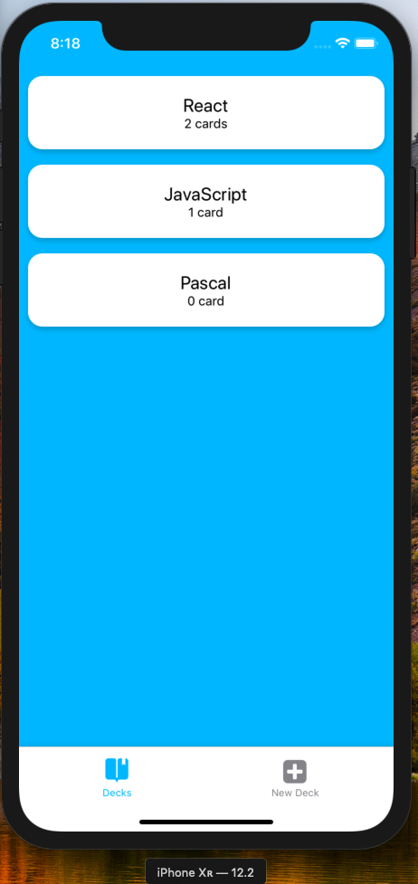

# pr3-mobile-flashcards
The app will allow users to create different categories of flashcards called "decks", add flashcards to those decks, then take quizzes on those decks.
#### Udacity React Nanodegree program
This project is connected to the _React Nanodegree Program_ course by **Udacity**.

In this Project called  **Mobile Flashcards**, build a mobile application (**Android** or **iOS** - or both) that allows users to study collections of flashcards. The app will allow users to create different categories of flashcards called "decks", add flashcards to those decks, then take quizzes on those decks.
This project encompasses the fundamental aspects of building a native application including handling infinite lists, routing, and user input. By building this project, we will gain an understanding of how to use React Native to build an **Android** and **iOS** application.


## Environment
This program requires **node.js** and **npm** program envirenment
Go to [Node.js](https://nodejs.org/en/download/) downloads page and install it if it's not installed yet.
This program requires **Expo**  program envirenment .
Expo is a service that makes just about everything involving React Native a whole lot easier.
The idea behind Expo is that there's no need to use Android Studio or Xcode. What's more: it even allows us to develop for iOS with Windows (or even Linux)!

## Install Expo
Run `npm install -g exp`  to install exp globally.

## Install
Clone  project files from [GitHub](https://github.com/nacikaly17/pr3-mobile-flashcards.git) .
First create a local working directory and then get the project files:
```
          Clone:
$ git clone https://github.com/nacikaly17/pr3-mobile-flashcards.git
          Change to project directory:
$ cd pr3-mobile-flashcards
```
## Available Scripts

After cloning the project files you will find in the project directory the scripts:  You can run:

* install all project dependencies with `npm install`
* start the development server with `expo start`

Open [http://localhost:19002](http://localhost:19002) to view it in the browser.

## iOS platform simulation test screens .



## Notification .
Every day at 8 o'clock user is going to get a local notification to remind themself to study if he/she hasn't already for that day as soon as 
added a new card to deck.

## Create React Native App

This project was bootstrapped with [create-react-native-app](https://github.com/facebookincubator/create-react-app). You can find more information on how to perform common tasks [here](https://facebook.github.io/react-native/docs/getting-started.html).
Note that Create React Native App uses Expo CLI under the hood. You can get up and running with React Native using the instructions on this page, but feel free to visit the React Native Quick Start guide if you prefer to use "vanilla" Expo CLI as an alternative.
